# UNIVERSIDAD DE SAN CARLOS DE GUATEMALA
# REDES DE COMPUTADORAS 1
# LABORATORIO DE REDES DE COMPUTADORAS 1


# Manual de construcción y configuración

- [Manual de construcción y configuración](#manual-de-construcción-y-configuración)
  - [Integrantes](#integrantes)
  - [Configuración](#configuración)
    - [Topología 1](#topología-1)
      - [Distribución de pc's en topología 1](#distribución-de-pcs-en-topología-1)
      - [Configuración de ethernet switch](#configuración-de-ethernet-switch)
    - [Topología 2](#topología-2)
      - [Distribución de pc's en topología 2](#distribución-de-pcs-en-topología-2)
    - [VPN](#vpn)
      - [Configuracion de un nuevo cliente VPN](#Configuracion-de-un-nuevo-cliente-VPN)
    - [Máquinas virtuales](#máquinas-virtuales)

## Integrantes

### Grupo: 19

|   Carné   | Nombre                                |
| :-------: | ------------------------------------- |
| 201020831 | Marco Antonio Fidencio Chávez Fuentes |
| 201602421 | Diego Alejandro Vasquez               |
| 201612331 | José Orlando Wannan Escobar           |
| 201712350 | Helmut Efrain Najarro Alvarez         |

## Configuración

### Topología 1

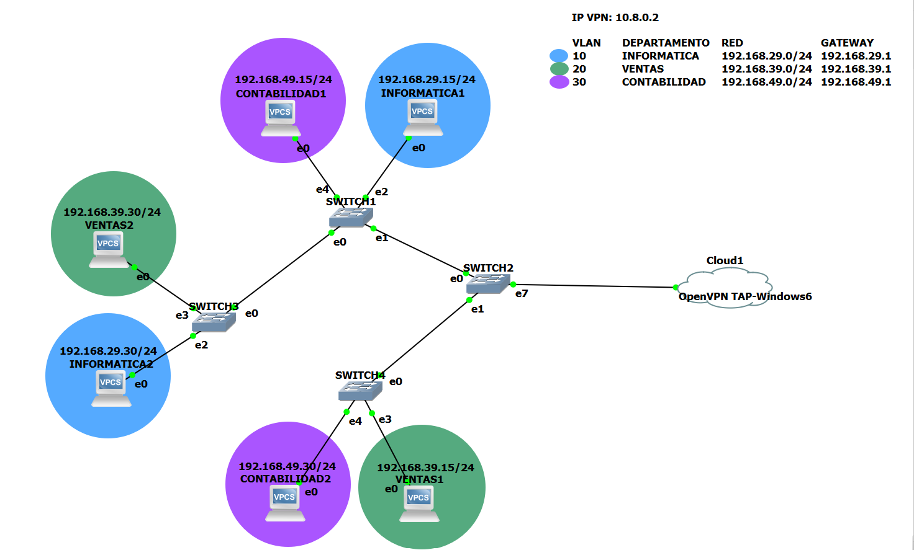

Se utilizaron 3 Ethernet switch y 3 VPCS obtenidos desde GNS3 así como también 3 instancias de VM obtenidas desde VMWare. Todas las pc's conectadas en esta topología son clientes y consumirán una página web de su respectivo departamento ubicada en la topología 2.

#### Distribución de pc's en topología 1

| VIRTUAL | HOST          | SWITCH  |   DIRECCIÓN IP   |   GATEWAY    |
| :-----: | ------------- | ------- | :--------------: | :----------: |
|   SI    | INFORMATICA1  | SWITCH1 | 192.168.29.15/24 | 192.168.29.1 |
|   NO    | INFORMATICA2  | SWITCH3 | 192.168.29.30/24 | 192.168.29.1 |
|   SI    | VENTAS1       | SWITCH4 | 192.168.39.15/24 | 192.168.39.1 |
|   NO    | VENTAS2       | SWITCH3 | 192.168.39.30/24 | 192.168.39.1 |
|   NO    | CONTABILIDAD1 | SWITCH1 | 192.168.49.15/24 | 192.168.49.1 |
|   SI    | CONTABILIDAD2 | SWITCH4 | 192.168.49.30/24 | 192.168.49.1 |

En todos los switches se configuró las 3 vlan para que tengan acceso las pc's y 2 puertos troncales para interconectarse entre switches

#### Configuración de ethernet switch

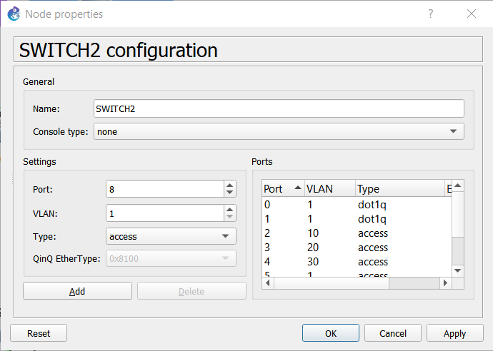

En cada ethernet switch se configuraron los puertos troncales y de acceso para las vlan. Se configuraron los puertos 0 y 1 como puertos troncales y los puertos 2, 3 y 4 para acceso a las vlan 10, 20 y 30 respectivamente.

Luego, cada pc se conectó a su respectivo puerto en cada switch para poder acceder a su respectiva red. Para esto se le definieron sus respectivas dirección ip con el gateway definido para cada vlan.

```bash
# Configuración en pc 1 de la vlan informatica
ip 192.168.29.15/24 192.168.29.1

# Comprobar conexión en la vlan
ping 192.168.29.30
```

#### Codigo configuracion Switch
##### Switch 1

```bash
enable
configure terminal

vlan 29
name vlan10
exit
vlan 39
name vlan39
exit
vlan 49
name vlan49
exit

interface f1/1
switchport mode access
switchport access vlan 29
no shutdown
exit
interface f1/2
switchport mode access
switchport access vlan 39
no shutdown
exit
interface f1/3
switchport mode access
switchport access vlan 49
no shutdown
exit
do sh vlan-s

interface f1/10
switchport mode trunk
exit
interface f1/11
switchport mode trunk
exit

exit
copy running-config startup-config
```

### Topología 2

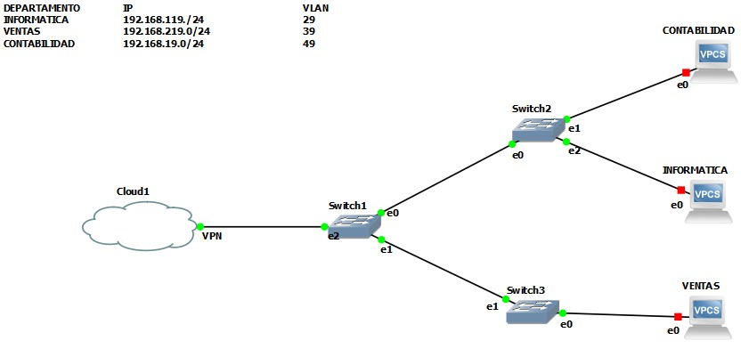

Se utilizaron 3 Ethernet Switch y 3 VPCS.

#### Distribución de pc's en topología 2

| VIRTUAL | HOST          | SWITCH        | DIRECCIÓN IP  | GATEWAY      |
| :-----: | :-----------: | :-----------: | :-----------: | :----------: |
|  SI     | INFORMATICA   | SWITCH2       | 192.168.119.0 | 192.168.29.1 |
|  SI     | CONTABILIDAD  | SWITCH2       | 192.168.19.0  | 192.168.49.1 |
|  SI     | VENTAS        | SWITCH1       | 192.168.129.0 | 192.168.39.1 |

#### Configuración de ethernet switch

##### Switch 2

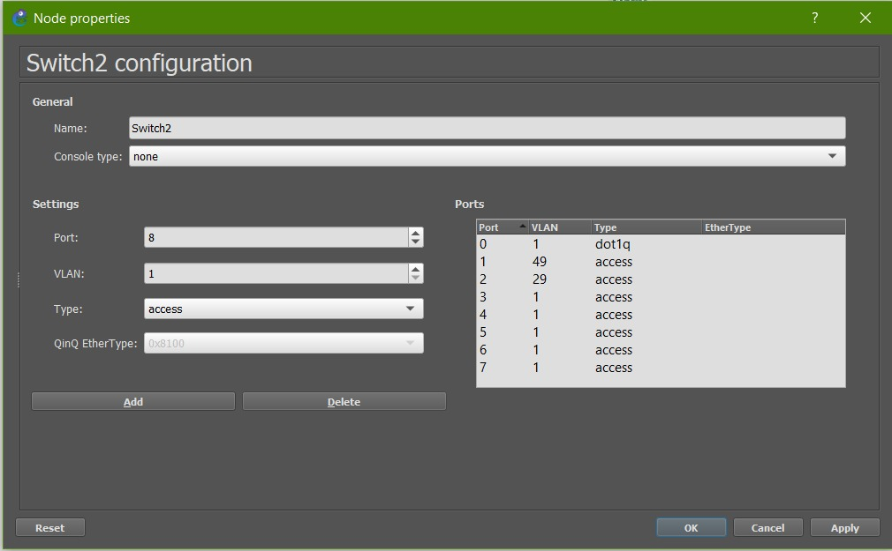

##### Switch 1

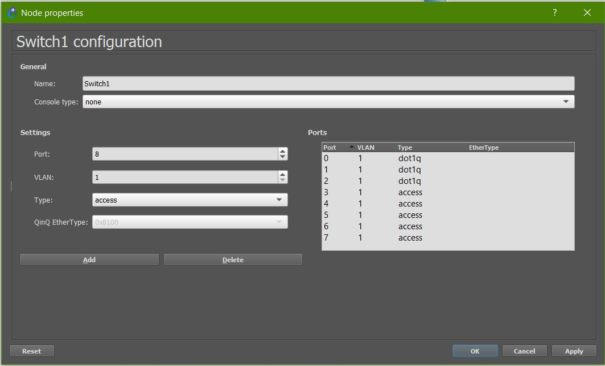

##### Switch 3

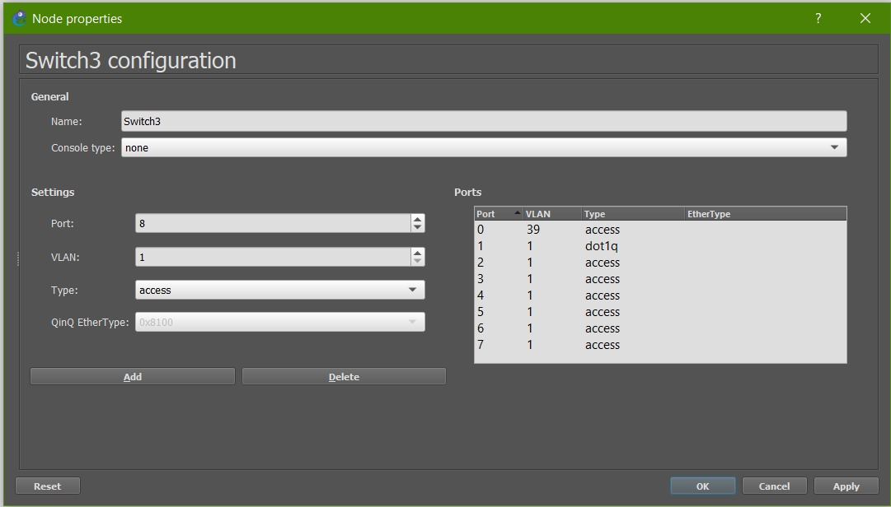

### VPN

#### Configuracion de un nuevo cliente VPN

1. En una Instancia de VM's, ejecuta la siguiente instruccion

```
    $ sudo bash openvpn-install.sh
```
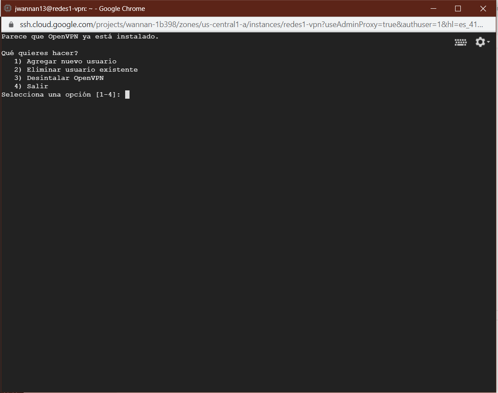

2. Selecciona la opcion 1.
3. Ingresa el nombre de tu nuevo cliente.
4. Descarga el archivo .ovn, el cual servira para que el cliente openvpn pueda conectarse a la vpn.

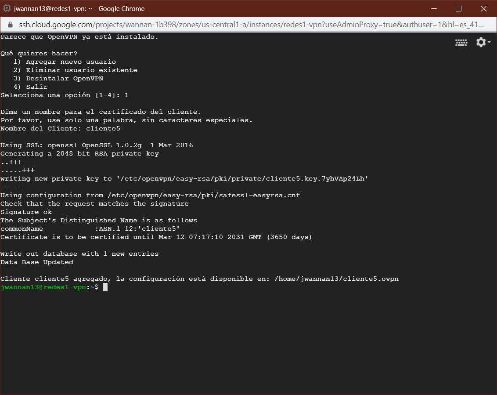

### Máquinas virtuales

#### VM, maquinas virtuales

```
Maquina 1 - ventas
```
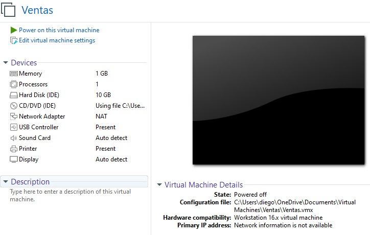 

```
Maquina 2 - Contabilidad
```

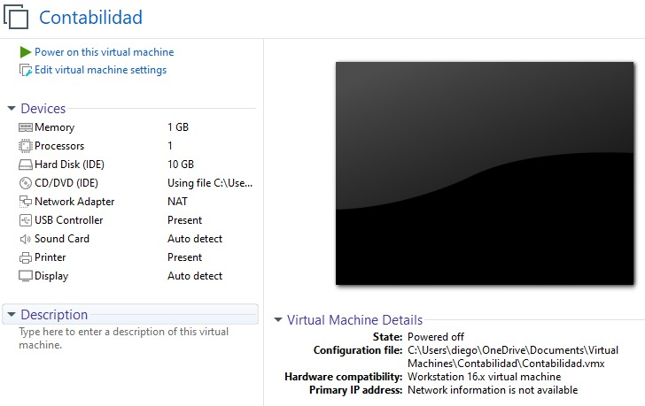 


```
Maquina 3 - Informatica
```

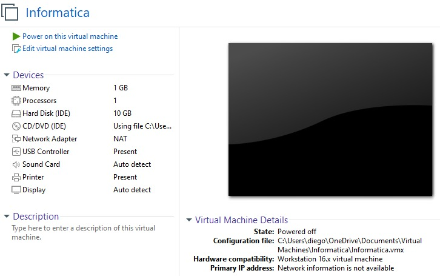 